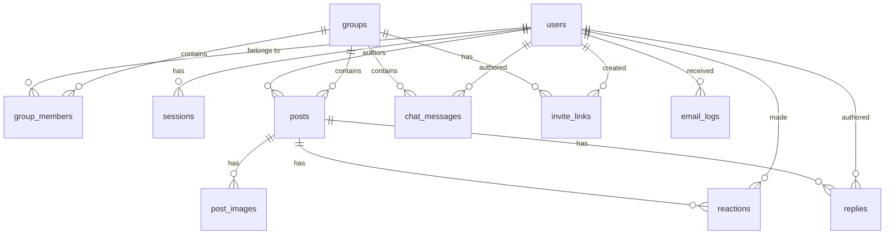
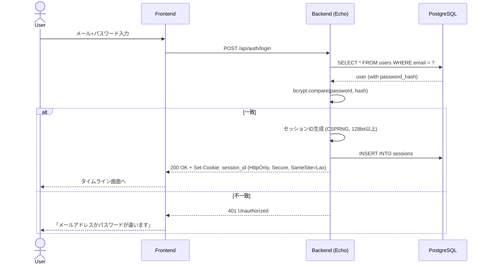
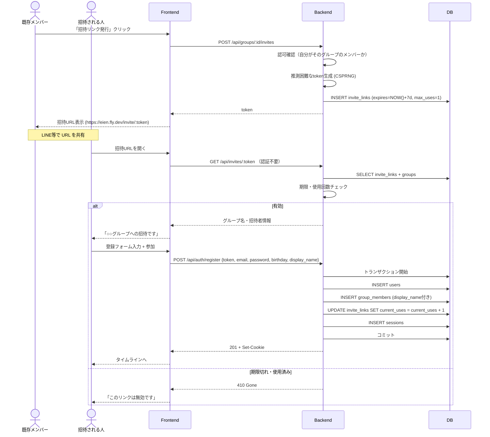
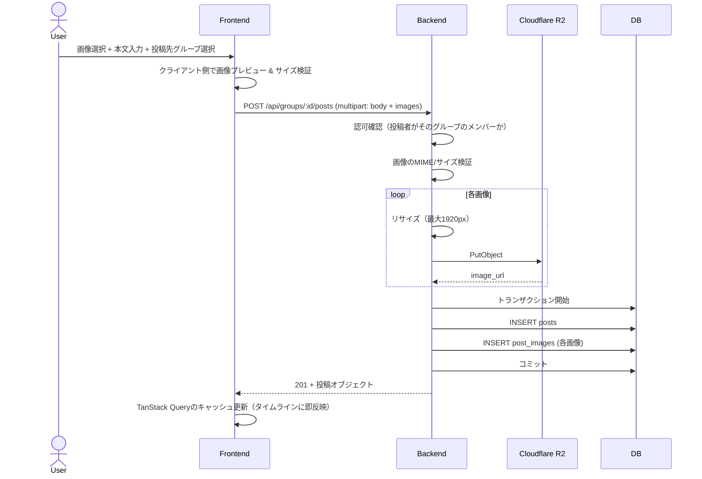
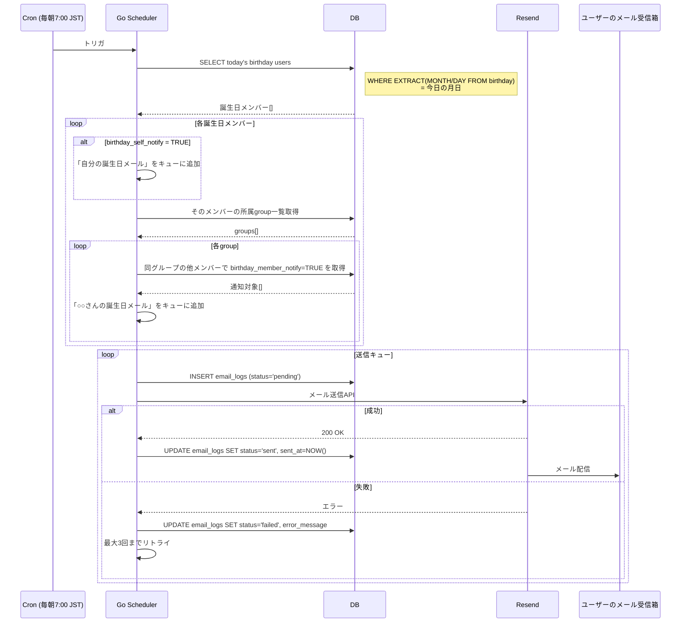

# Eien 設計書

> 要件定義書（[`requirements.md`](requirements.md)）で定めた内容を、実装可能な設計レベルに落とし込むドキュメント。

## 目次

1. [ディレクトリ構成・アーキテクチャ](#1-ディレクトリ構成アーキテクチャ)
2. [DBスキーマ設計](#2-dbスキーマ設計)
3. [API設計](#3-api設計)
4. [主要フローのシーケンス図](#4-主要フローのシーケンス図)
5. [画面設計（ワイヤーフレーム）](#5-画面設計ワイヤーフレーム)

---

## 1. ディレクトリ構成・アーキテクチャ

### 1.1 全体方針

- **モノレポ**：1つのGitリポジトリにフロント・バック・ドキュメントをまとめる。
  - 個人開発で一人が両方触る。
  - フロント/バックの契約変更を1PRで完結できる。
  - ポートフォリオで全体像を見せやすい。
- **フロント `/frontend`、バック `/backend` で分離**：それぞれ独立してビルド・テスト・デプロイ可能。

### 1.2 リポジトリ全体ツリー

```
eien/
├── README.md                    # プロジェクト概要
├── .gitignore
├── .env.example                 # 環境変数テンプレート
├── docker-compose.yml           # ローカル開発: フロント+バック+DB+Mailhog
├── .github/
│   └── workflows/
│       ├── ci.yml               # PR時: lint, test, build
│       └── deploy.yml           # main: Fly.ioデプロイ
│
├── docs/                        # 設計・運用ドキュメント
│   ├── requirements.md
│   ├── security_checklist.md
│   ├── design.md                # 本ファイル
│   └── api/
│       └── openapi.yaml         # API仕様（機械可読）
│
├── frontend/                    # React + Vite
│   ├── package.json
│   ├── vite.config.ts
│   ├── tsconfig.json
│   ├── tailwind.config.js
│   ├── index.html
│   ├── public/
│   └── src/
│       ├── main.tsx             # エントリーポイント
│       ├── App.tsx              # ルートコンポーネント
│       ├── routes/              # ページ単位のコンポーネント
│       ├── components/          # 再利用可能なUI
│       ├── api/                 # APIクライアント（OpenAPIから生成された型 + ラッパー）
│       ├── hooks/               # カスタムフック
│       ├── lib/                 # ユーティリティ
│       └── types/               # 共通型定義
│
└── backend/                     # Go + Echo
    ├── go.mod
    ├── go.sum
    ├── Dockerfile
    ├── sqlc.yaml                # sqlc設定
    ├── cmd/
    │   └── server/
    │       └── main.go          # エントリーポイント
    ├── internal/
    │   ├── config/              # 環境変数読み込み
    │   ├── handler/             # HTTPハンドラ層（Controller相当）
    │   ├── service/             # ビジネスロジック層
    │   ├── repository/          # DBアクセス層（sqlc生成コードのラッパー）
    │   ├── domain/              # ドメインモデル・型定義
    │   ├── middleware/          # 認証・CORS・ロギング等
    │   ├── mailer/              # メール送信
    │   └── scheduler/           # 誕生日通知の定時実行
    └── db/
        ├── migrations/          # SQLマイグレーション（golang-migrate形式）
        ├── queries/             # sqlcのSQLクエリ定義
        └── sqlc/                # sqlcが生成するGoコード（gitignore対象）
```

### 1.3 バックエンドのアーキテクチャ層

Goでは「**レイヤードアーキテクチャ**」（クリーンアーキテクチャの簡易版）を採用する。

```
[HTTPリクエスト]
       ↓
┌─────────────────────────────┐
│  middleware                 │  認証・CORS・ロギング
└─────────────┬───────────────┘
              ↓
┌─────────────────────────────┐
│  handler                    │  HTTPの入出力（JSONバインド、ステータスコード）
└─────────────┬───────────────┘
              ↓
┌─────────────────────────────┐
│  service                    │  ビジネスロジック（「誰がどのグループに投稿できるか」など）
└─────────────┬───────────────┘
              ↓
┌─────────────────────────────┐
│  repository                 │  DBアクセス（sqlc生成コードのラッパー）
└─────────────┬───────────────┘
              ↓
        [PostgreSQL]
```

**各層の責務**：

| 層 | 役割 | やってはいけないこと |
| --- | --- | --- |
| handler | HTTPリクエストをパースし、serviceを呼び、結果をJSONで返す | ビジネスロジックを書く、SQL書く |
| service | ビジネスルールを実行する。複数のrepositoryを組み合わせる | HTTPやDBの詳細を知る |
| repository | sqlcの生成コードを呼ぶ・組み合わせる | ビジネスロジックを書く |
| domain | 業務上の型定義（User、Group、Post等） | 外部依存を持つ |

### 1.4 フロントエンドの構成

```
src/
├── routes/             # ルーティング上の各ページ
│   ├── login.tsx
│   ├── timeline.tsx
│   ├── post-create.tsx
│   ├── group-list.tsx
│   └── ...
├── components/
│   ├── ui/             # ボタン、入力欄など汎用UI
│   ├── post/           # 投稿関連コンポーネント
│   ├── group/          # グループ関連
│   └── layout/         # ヘッダー、ナビゲーション等
├── api/
│   ├── generated/      # OpenAPIから自動生成された型・関数（gitignore外）
│   └── client.ts       # API呼び出しラッパー（エラーハンドリング等）
├── hooks/              # useAuth, useGroup など
├── lib/                # 日付フォーマット等のユーティリティ
└── types/              # アプリ独自の型
```

### 1.5 設計判断の意図（学習メモ）

- **handler/service/repositoryに分けるのはなぜ？**
  → 後でテストしやすい。serviceのテストではDBを呼ばず、repositoryをモックに差し替えられる。
- **domainを別にするのはなぜ？**
  → 「Userとは何か」をDB都合・HTTP都合と切り離して定義することで、後で構造が変わっても影響範囲を狭められる。
- **internal/ に入れるのはなぜ？**
  → Goの慣習。`internal/` 配下は他のリポジトリからimportできない。意図せず外部から使われるのを防げる。

---

## 2. DBスキーマ設計

### 2.1 設計方針

| 項目 | 採用 | 理由 |
| --- | --- | --- |
| ID型 | UUID v4 (`gen_random_uuid()`) | パブリック公開時にIDの順序が見えない、推測困難 |
| タイムスタンプ | `created_at` / `updated_at` を全テーブル | 監査・デバッグの基本 |
| 文字コード | UTF-8 / `TEXT`型 | 絵文字含む日本語対応、長さ制約はアプリ層で |
| 削除方針 | 投稿・返信・チャット = soft delete (`deleted_at`)、他 = hard delete | 誤削除復旧 + 関連データ整合性 |
| 通知設定 | `users` テーブルにフラグ列で持つ | 1ユーザー1設定でMVPは十分 |
| リアクション | 固定セット（like / celebrate / heart / wow / clap） | MVPシンプル化、UI実装も簡単 |
| マルチグループ×プロフィール | `group_members` 中間テーブルに `display_name`, `icon_url` を持つ | Eien独自要件の核 |

### 2.2 ER図



### 2.3 テーブル定義

#### users（アカウント本体）

| カラム | 型 | 制約 | 説明 |
| --- | --- | --- | --- |
| id | UUID | PK, DEFAULT gen_random_uuid() | |
| email | TEXT | UNIQUE NOT NULL | ログイン用 |
| password_hash | TEXT | NOT NULL | bcrypt ハッシュ |
| birthday | DATE | NOT NULL | 誕生日通知の根幹 |
| birthday_self_notify | BOOLEAN | NOT NULL DEFAULT TRUE | 自分の誕生日にメール送信 |
| birthday_member_notify | BOOLEAN | NOT NULL DEFAULT TRUE | 仲間の誕生日にメール送信 |
| post_notify | BOOLEAN | NOT NULL DEFAULT FALSE | 新規投稿のたびに通知（デフォルトOFF） |
| created_at | TIMESTAMPTZ | NOT NULL DEFAULT NOW() | |
| updated_at | TIMESTAMPTZ | NOT NULL DEFAULT NOW() | |

#### groups（グループ）

| カラム | 型 | 制約 | 説明 |
| --- | --- | --- | --- |
| id | UUID | PK, DEFAULT gen_random_uuid() | |
| name | TEXT | NOT NULL | グループ名 |
| description | TEXT | | 任意 |
| created_by_user_id | UUID | NOT NULL REFERENCES users(id) | グループ作成者 |
| created_at | TIMESTAMPTZ | NOT NULL DEFAULT NOW() | |
| updated_at | TIMESTAMPTZ | NOT NULL DEFAULT NOW() | |

#### group_members（中間テーブル：マルチグループ × プロフィール）

| カラム | 型 | 制約 | 説明 |
| --- | --- | --- | --- |
| id | UUID | PK, DEFAULT gen_random_uuid() | |
| user_id | UUID | NOT NULL REFERENCES users(id) | |
| group_id | UUID | NOT NULL REFERENCES groups(id) | |
| display_name | TEXT | NOT NULL | グループ内表示名 |
| icon_url | TEXT | | グループ内アイコン（任意） |
| role | TEXT | NOT NULL DEFAULT 'member' CHECK (role IN ('admin', 'member')) | 管理者 or 一般 |
| joined_at | TIMESTAMPTZ | NOT NULL DEFAULT NOW() | |

**制約**：`UNIQUE (user_id, group_id)` — 同一ユーザーは同一グループに1レコードのみ
**インデックス**：`user_id`、`group_id` 個別

#### invite_links（招待リンク）

| カラム | 型 | 制約 | 説明 |
| --- | --- | --- | --- |
| id | UUID | PK, DEFAULT gen_random_uuid() | |
| group_id | UUID | NOT NULL REFERENCES groups(id) | |
| token | TEXT | UNIQUE NOT NULL | 推測困難な128bitトークン |
| created_by_user_id | UUID | NOT NULL REFERENCES users(id) | |
| expires_at | TIMESTAMPTZ | NOT NULL | デフォルト 7日後 |
| max_uses | INTEGER | NOT NULL DEFAULT 1 | デフォルト1回限り |
| current_uses | INTEGER | NOT NULL DEFAULT 0 | |
| created_at | TIMESTAMPTZ | NOT NULL DEFAULT NOW() | |

#### posts（投稿）

| カラム | 型 | 制約 | 説明 |
| --- | --- | --- | --- |
| id | UUID | PK, DEFAULT gen_random_uuid() | |
| group_id | UUID | NOT NULL REFERENCES groups(id) | 投稿先グループ |
| author_user_id | UUID | NOT NULL REFERENCES users(id) | |
| body | TEXT | NOT NULL | 本文（最大1000字、アプリ層で検証） |
| created_at | TIMESTAMPTZ | NOT NULL DEFAULT NOW() | |
| updated_at | TIMESTAMPTZ | NOT NULL DEFAULT NOW() | |
| deleted_at | TIMESTAMPTZ | | soft delete用 |

**インデックス**：`(group_id, created_at DESC)` — タイムライン取得の高速化

#### post_images（投稿画像）

| カラム | 型 | 制約 | 説明 |
| --- | --- | --- | --- |
| id | UUID | PK, DEFAULT gen_random_uuid() | |
| post_id | UUID | NOT NULL REFERENCES posts(id) ON DELETE CASCADE | |
| image_url | TEXT | NOT NULL | R2上のURL |
| sort_order | INTEGER | NOT NULL DEFAULT 0 | 表示順 |
| created_at | TIMESTAMPTZ | NOT NULL DEFAULT NOW() | |

#### reactions（リアクション）

| カラム | 型 | 制約 | 説明 |
| --- | --- | --- | --- |
| id | UUID | PK, DEFAULT gen_random_uuid() | |
| post_id | UUID | NOT NULL REFERENCES posts(id) ON DELETE CASCADE | |
| user_id | UUID | NOT NULL REFERENCES users(id) | |
| reaction_type | TEXT | NOT NULL CHECK (reaction_type IN ('like', 'celebrate', 'heart', 'wow', 'clap')) | |
| created_at | TIMESTAMPTZ | NOT NULL DEFAULT NOW() | |

**制約**：`UNIQUE (post_id, user_id, reaction_type)` — 同じリアクションは1人1個

#### replies（返信）

| カラム | 型 | 制約 | 説明 |
| --- | --- | --- | --- |
| id | UUID | PK, DEFAULT gen_random_uuid() | |
| post_id | UUID | NOT NULL REFERENCES posts(id) ON DELETE CASCADE | |
| author_user_id | UUID | NOT NULL REFERENCES users(id) | |
| body | TEXT | NOT NULL | |
| created_at | TIMESTAMPTZ | NOT NULL DEFAULT NOW() | |
| deleted_at | TIMESTAMPTZ | | soft delete |

**インデックス**：`(post_id, created_at)` — 投稿の返信一覧取得

#### chat_messages（グループチャット, Phase 1）

| カラム | 型 | 制約 | 説明 |
| --- | --- | --- | --- |
| id | UUID | PK, DEFAULT gen_random_uuid() | |
| group_id | UUID | NOT NULL REFERENCES groups(id) | |
| author_user_id | UUID | NOT NULL REFERENCES users(id) | |
| body | TEXT | NOT NULL | |
| created_at | TIMESTAMPTZ | NOT NULL DEFAULT NOW() | |
| deleted_at | TIMESTAMPTZ | | soft delete |

**インデックス**：`(group_id, created_at DESC)`

#### sessions（セッション）

| カラム | 型 | 制約 | 説明 |
| --- | --- | --- | --- |
| id | TEXT | PK | 推測困難なセッションID（128bit以上） |
| user_id | UUID | NOT NULL REFERENCES users(id) ON DELETE CASCADE | |
| expires_at | TIMESTAMPTZ | NOT NULL | |
| created_at | TIMESTAMPTZ | NOT NULL DEFAULT NOW() | |

**インデックス**：`user_id`（ログアウト時に同一ユーザーのセッション無効化用）

#### email_logs（メール送信ログ）

| カラム | 型 | 制約 | 説明 |
| --- | --- | --- | --- |
| id | UUID | PK, DEFAULT gen_random_uuid() | |
| recipient_user_id | UUID | REFERENCES users(id) | |
| email_type | TEXT | NOT NULL | `birthday_self`, `birthday_member`, `invitation`, `reset_password` 等 |
| recipient_email | TEXT | NOT NULL | 送信時点のメールアドレスを記録 |
| subject | TEXT | NOT NULL | |
| status | TEXT | NOT NULL CHECK (status IN ('pending', 'sent', 'failed')) | |
| error_message | TEXT | | 失敗時 |
| sent_at | TIMESTAMPTZ | | |
| created_at | TIMESTAMPTZ | NOT NULL DEFAULT NOW() | |

### 2.4 主要なクエリ例（学習用）

**例1：タイムライン取得（ユーザーが所属する全グループの投稿を時系列で）**

```sql
SELECT p.id, p.body, p.created_at,
       gm.display_name, gm.icon_url,
       g.name AS group_name, g.id AS group_id
FROM posts p
INNER JOIN group_members gm
  ON gm.user_id = p.author_user_id AND gm.group_id = p.group_id
INNER JOIN groups g ON g.id = p.group_id
WHERE p.group_id IN (
    SELECT group_id FROM group_members WHERE user_id = $1
)
  AND p.deleted_at IS NULL
ORDER BY p.created_at DESC
LIMIT 20 OFFSET $2;
```

**ポイント**：投稿の表示名は `users.email` ではなく `group_members.display_name` を使う。これがマルチプロフィール設計の効果。

**例2：今日が誕生日のメンバーを取得**

```sql
SELECT u.id, u.email, u.birthday
FROM users u
WHERE EXTRACT(MONTH FROM u.birthday) = EXTRACT(MONTH FROM NOW())
  AND EXTRACT(DAY FROM u.birthday) = EXTRACT(DAY FROM NOW());
```

**ポイント**：年は無視、月日のみで照合。誕生日通知バッチで使う。

### 2.5 データライフサイクル

- **users**：論理削除なし（参照整合性維持のため、削除はPhase 1以降に詳細設計）
- **posts / replies / chat_messages**：`deleted_at` で論理削除。バッチで30日後に物理削除する選択肢あり（後で検討）
- **sessions**：期限切れは日次バッチでクリーンアップ
- **invite_links**：期限切れは日次バッチでクリーンアップ
- **email_logs**：90日経過で物理削除（テーブル肥大防止）

---

## 3. API設計

### 3.1 設計方針

- **REST** スタイル。GraphQLやtRPCは規模に対して過剰。
- **認証**：セッションCookie方式（HttpOnly + Secure + SameSite=Lax）。`Authorization` ヘッダ不要。
- **レスポンス**：すべてJSON。
- **ページネーション**：オフセット方式（`?limit=20&offset=0`）。MVPはこれで十分、必要になったらカーソル方式に移行。
- **URLプレフィックス**：`/api/` （バージョンなし。必要になったら `/api/v1/` に切替）。

### 3.2 共通レスポンス形式

**成功（リソース取得・作成・更新）**：
```json
{
  "id": "uuid",
  "name": "...",
  "created_at": "2026-05-03T10:00:00+09:00"
}
```

**成功（リスト取得）**：
```json
{
  "items": [ { ... }, { ... } ],
  "pagination": {
    "total": 123,
    "limit": 20,
    "offset": 0
  }
}
```

**エラー**：
```json
{
  "error": {
    "code": "VALIDATION_ERROR",
    "message": "メールアドレスの形式が正しくありません",
    "details": [
      { "field": "email", "reason": "invalid_format" }
    ]
  }
}
```

### 3.3 HTTPステータスコード規約

| コード | 用途 |
| --- | --- |
| 200 OK | 取得・更新成功 |
| 201 Created | 作成成功 |
| 204 No Content | 削除成功（レスポンスボディなし） |
| 400 Bad Request | リクエストの形式不正・バリデーションエラー |
| 401 Unauthorized | 未ログイン |
| 403 Forbidden | ログイン済みだが権限なし |
| 404 Not Found | リソースが存在しない |
| 409 Conflict | 重複（メールアドレスなど） |
| 422 Unprocessable Entity | ビジネスルール違反 |
| 500 Internal Server Error | サーバ側の不具合 |

### 3.4 エンドポイント一覧

#### 認証

| メソッド | パス | 認証 | 用途 |
| --- | --- | --- | --- |
| POST | /api/auth/register | 不要 | 新規登録 |
| POST | /api/auth/login | 不要 | ログイン |
| POST | /api/auth/logout | 必要 | ログアウト |
| GET | /api/auth/me | 必要 | 現在のユーザー情報 |

#### ユーザー

| メソッド | パス | 認証 | 用途 |
| --- | --- | --- | --- |
| PATCH | /api/users/me | 必要 | 自分のプロフィール（誕生日含む）更新 |
| GET | /api/users/me/notifications | 必要 | 通知設定取得 |
| PATCH | /api/users/me/notifications | 必要 | 通知設定更新 |

#### グループ

| メソッド | パス | 認証 | 用途 |
| --- | --- | --- | --- |
| POST | /api/groups | 必要 | グループ作成 |
| GET | /api/groups | 必要 | 自分の所属グループ一覧 |
| GET | /api/groups/:id | 必要 | グループ詳細 |
| GET | /api/groups/:id/members | 必要 | メンバー一覧 |
| PATCH | /api/groups/:id/profile | 必要 | 自分のグループ内プロフィール更新 |

#### 招待

| メソッド | パス | 認証 | 用途 |
| --- | --- | --- | --- |
| POST | /api/groups/:id/invites | 必要 | 招待リンク発行 |
| GET | /api/invites/:token | 不要 | 招待リンク情報取得（参加前プレビュー） |
| POST | /api/invites/:token/accept | 必要 | 招待リンクで参加 |

#### 投稿

| メソッド | パス | 認証 | 用途 |
| --- | --- | --- | --- |
| POST | /api/groups/:id/posts | 必要 | 投稿作成 |
| GET | /api/timeline | 必要 | 全所属グループのタイムライン |
| GET | /api/groups/:id/posts | 必要 | グループ別投稿一覧 |
| GET | /api/posts/:id | 必要 | 投稿詳細 |
| DELETE | /api/posts/:id | 必要 | 投稿削除 |

#### リアクション・返信

| メソッド | パス | 認証 | 用途 |
| --- | --- | --- | --- |
| POST | /api/posts/:id/reactions | 必要 | リアクション追加 |
| DELETE | /api/posts/:id/reactions/:type | 必要 | リアクション削除 |
| GET | /api/posts/:id/replies | 必要 | 返信一覧 |
| POST | /api/posts/:id/replies | 必要 | 返信作成 |
| DELETE | /api/replies/:id | 必要 | 返信削除 |

#### 誕生日

| メソッド | パス | 認証 | 用途 |
| --- | --- | --- | --- |
| GET | /api/birthdays/today | 必要 | 今日の誕生日メンバー（豪華表示用） |

#### 画像

| メソッド | パス | 認証 | 用途 |
| --- | --- | --- | --- |
| POST | /api/images/upload | 必要 | 画像アップロード（multipart/form-data） |

#### チャット（Phase 1）

| メソッド | パス | 認証 | 用途 |
| --- | --- | --- | --- |
| GET | /api/groups/:id/messages | 必要 | チャット履歴取得 |
| POST | /api/groups/:id/messages | 必要 | チャット送信 |

### 3.5 主要エンドポイントの詳細仕様

#### POST /api/auth/login

**リクエスト**：
```json
{
  "email": "user@example.com",
  "password": "..."
}
```

**レスポンス（200 OK）**：
- `Set-Cookie` ヘッダで `session_id` を発行（HttpOnly, Secure, SameSite=Lax）
```json
{
  "id": "uuid",
  "email": "user@example.com",
  "birthday": "1995-04-01"
}
```

**エラー**：
- 400：バリデーションエラー
- 401：認証失敗（メールアドレスかパスワードが違う、詳細は意図的に返さない）

#### GET /api/timeline

**クエリパラメータ**：`?limit=20&offset=0`

**レスポンス（200 OK）**：
```json
{
  "items": [
    {
      "id": "post-uuid",
      "group": {
        "id": "group-uuid",
        "name": "高校時代の仲間"
      },
      "author": {
        "user_id": "user-uuid",
        "display_name": "たかし",
        "icon_url": "https://r2..."
      },
      "body": "結婚しました！",
      "images": [
        { "url": "https://r2...", "sort_order": 0 }
      ],
      "reactions": {
        "celebrate": 5,
        "heart": 3
      },
      "reply_count": 4,
      "created_at": "2026-05-03T10:00:00+09:00"
    }
  ],
  "pagination": { "total": 42, "limit": 20, "offset": 0 }
}
```

#### POST /api/groups/:id/posts

**リクエスト**：
```json
{
  "body": "結婚式しました！",
  "image_ids": ["uuid1", "uuid2"]
}
```
※画像は事前に `/api/images/upload` でアップロード済みのIDを渡す。

**レスポンス（201 Created）**：投稿リソースを返す。

### 3.6 OpenAPI仕様書

機械可読な完全な仕様は [`docs/api/openapi.yaml`](api/openapi.yaml) に記載。
- フロントエンドは `openapi-typescript` でこのyamlからTS型を自動生成。
- バックエンドは実装と齟齬がないか、手動またはツール（`oapi-codegen` 等）で検証。

---

## 4. 主要フローのシーケンス図

### 4.1 ログインフロー



**学習ポイント**：
- 認証失敗時のメッセージは「**どっちが間違ってるか**」を明かさない（ユーザー列挙攻撃の防止）。
- セッションIDはDBに保存。これによりログアウトや強制ログアウトが効く（JWTだと取り消せない）。

### 4.2 招待リンク発行 & 参加フロー（Eien独自）



**学習ポイント**：
- 招待リンク参照は **認証不要**（未登録の人がリンクを開くため）。
- 登録 + グループ参加 + セッション作成は **DBトランザクションで一括実行**（途中で失敗したら全てロールバック）。

### 4.3 投稿作成フロー（画像付き）



**学習ポイント**：
- 画像とテキストを **1リクエストで送信**するシンプル方式（MVP）。将来UX改善時に「画像→ID→投稿」の2-stepに分離可能。
- TanStack Query の **楽観的更新** を使えば、投稿後にAPI再取得せず即座にUI反映できる。

### 4.4 誕生日通知の定時実行フロー（Eien独自・最重要）



**学習ポイント**：
- **Cronの実装方法**：Fly.io の `[deploy] release_command` か、Goアプリ内で `robfig/cron` ライブラリを使う方法。
- **email_logs を必ず記録**：失敗時の調査と、「同じメールを2回送らない」ためのべき等性確保に使える。
- **goroutine で並行送信**できる（Goの強みが活きる場面）。
- **タイムゾーン**：DBの `birthday` は DATE型なのでタイムゾーンを持たない。今日の日付計算は `JST` で行うことを明示する必要あり。

---

## 5. 画面設計（ワイヤーフレーム）

> モバイル幅（〜768px）を主に設計。PCはレスポンシブで自動展開（左右の余白を増やすか、サイドバー追加）。
> ワイヤーフレームはASCIIで構造のみ表現し、ビジュアルデザインは実装フェーズで詰める。

### 5.1 画面一覧と遷移

| # | 画面 | 認証 | URL |
| --- | --- | --- | --- |
| S-01 | ランディング | 不要 | `/` |
| S-02 | 新規登録 | 不要 | `/register` （招待トークン付）<br>`/invite/:token` |
| S-03 | ログイン | 不要 | `/login` |
| S-04 | タイムライン（ホーム） | 必要 | `/` （ログイン後） |
| S-05 | 投稿作成 | 必要 | `/posts/new` |
| S-06 | 投稿詳細 | 必要 | `/posts/:id` |
| S-07 | グループ一覧 | 必要 | `/groups` |
| S-08 | グループ詳細・メンバー一覧 | 必要 | `/groups/:id` |
| S-09 | グループ別プロフィール編集 | 必要 | `/groups/:id/profile` |
| S-10 | 招待リンク発行 | 必要 | `/groups/:id/invite` |
| S-11 | アカウント・通知設定 | 必要 | `/settings` |

### 5.2 主要画面ワイヤーフレーム

#### S-04 タイムライン（ホーム）

```
┌──────────────────────────────────┐
│  Eien                       [👤] │  ← ヘッダ（アバターから設定）
├──────────────────────────────────┤
│ ✨ 今日は たかし の誕生日 ✨       │  ← 誕生日豪華バナー
│   (該当日のみ大きく表示)          │
├──────────────────────────────────┤
│ [+ 投稿する]                     │  ← 投稿ボタン (大きめCTA)
├──────────────────────────────────┤
│ ┌──────────────────────────────┐ │
│ │ [👤] たかし @高校時代の仲間   │ │
│ │     5月3日                    │ │
│ │ 結婚しました！末長くよろしく！ │ │
│ │ ┌────────┬────────┐         │ │
│ │ │ [画像] │ [画像] │         │ │
│ │ └────────┴────────┘         │ │
│ │ 🎉 5  ❤️ 3  💬 2             │ │
│ └──────────────────────────────┘ │
│ ┌──────────────────────────────┐ │
│ │ ...次の投稿                   │ │
│ └──────────────────────────────┘ │
│                                  │
│      [もっと読み込む]             │  ← オフセットページネーション
├──────────────────────────────────┤
│  [🏠ホーム] [👥グループ] [🔔]    │  ← ボトムナビ（モバイル）
└──────────────────────────────────┘
```

**コンポーネント**：
- `<Header />`（ヘッダ・アバターメニュー）
- `<BirthdayBanner />`（誕生日該当日のみ表示）
- `<PostCard />`（再利用可能な投稿カード）
- `<BottomNav />`（モバイル時のみ表示、PCはサイドバー化）

**PC時の差分**：
- 左サイドバー（ナビゲーション）追加
- 中央コンテンツ幅 max 600px
- ボトムナビ非表示

#### S-05 投稿作成

```
┌──────────────────────────────────┐
│  [← 戻る]    投稿            [✓] │
├──────────────────────────────────┤
│  公開先 [▼ 高校時代の仲間   ]    │  ← 所属グループからセレクト
├──────────────────────────────────┤
│ ┌──────────────────────────────┐ │
│ │ 何があった？                  │ │  ← textarea (最大1000字)
│ │                              │ │
│ │                              │ │
│ └──────────────────────────────┘ │
│                          985/1000 │
├──────────────────────────────────┤
│ [📷 画像を追加 (0/4)]             │
│ ┌────┬────┐                     │
│ │ +  │ +  │                     │  ← 画像プレビュー
│ └────┴────┘                     │
└──────────────────────────────────┘
```

#### S-06 投稿詳細

```
┌──────────────────────────────────┐
│ [← 戻る]                         │
├──────────────────────────────────┤
│ [👤] たかし @高校時代の仲間       │
│     5月3日 10:30                 │
│ 結婚しました！                    │
│ ┌──────────────────────────────┐ │
│ │       [大きい画像]            │ │
│ └──────────────────────────────┘ │
│                                  │
│ 🎉 5   ❤️ 3   👏 2              │
│ [+ リアクション ▾]               │  ← 絵文字選択
├──────────────────────────────────┤
│ 返信 (2)                         │
│ ┌──────────────────────────────┐ │
│ │ [👤] あきこ                   │ │
│ │ おめでとう！！                │ │
│ └──────────────────────────────┘ │
│ ┌──────────────────────────────┐ │
│ │ [👤] みき                     │ │
│ │ お幸せに！                    │ │
│ └──────────────────────────────┘ │
├──────────────────────────────────┤
│ [返信を書く___________] [送信]   │
└──────────────────────────────────┘
```

#### S-07 グループ一覧

```
┌──────────────────────────────────┐
│  グループ                  [+ 新規] │
├──────────────────────────────────┤
│ ┌──────────────────────────────┐ │
│ │ [グループアイコン] 高校時代の  │ │
│ │ 仲間 (12人)                   │ │
│ │ あなた: たかし                │ │
│ └──────────────────────────────┘ │
│ ┌──────────────────────────────┐ │
│ │ [..] バスケ部OB (8人)         │ │
│ │ あなた: タカ                  │ │
│ └──────────────────────────────┘ │
│ ┌──────────────────────────────┐ │
│ │ [..] 家族 (5人)               │ │
│ │ あなた: お兄ちゃん            │ │
│ └──────────────────────────────┘ │
└──────────────────────────────────┘
```

**学習ポイント**：「あなた:」の表示が group_members.display_name から来ている。**グループごとに違う名前**で見えるのがマルチプロフィールの効果。

#### S-08 グループ詳細・メンバー一覧

```
┌──────────────────────────────────┐
│ [← 戻る]   高校時代の仲間   [⚙]   │
├──────────────────────────────────┤
│ メンバー (12人)        [招待リンク発行] │
├──────────────────────────────────┤
│ [👤] たかし (あなた)              │
│ [👤] あきこ                       │
│ [👤] みき                         │
│ [👤] こうじ                       │
│ ...                              │
├──────────────────────────────────┤
│ このグループの投稿              [→] │
│ このグループのチャット (Phase 1)   │
└──────────────────────────────────┘
```

#### S-09 グループ別プロフィール編集

```
┌──────────────────────────────────┐
│ [← 戻る]  プロフィール編集         │
├──────────────────────────────────┤
│  グループ名: 高校時代の仲間        │
├──────────────────────────────────┤
│  表示名 [たかし____________]      │
│                                  │
│  アイコン                        │
│   [現在のアイコン]                │
│   [📷 変更]                      │
├──────────────────────────────────┤
│            [保存]                │
└──────────────────────────────────┘
```

#### S-10 招待リンク発行

```
┌──────────────────────────────────┐
│ [← 戻る]  招待リンク              │
├──────────────────────────────────┤
│  高校時代の仲間 グループ           │
├──────────────────────────────────┤
│  有効期限 [▼ 7日間]               │
│  使用回数 [▼ 1回限り]             │
│            [リンクを発行]         │
├──────────────────────────────────┤
│  発行されたリンク：               │
│ ┌──────────────────────────────┐ │
│ │ https://eien.fly.dev/invite/. │ │
│ └──────────────────────────────┘ │
│ [📋 コピー]    [📤 共有]          │
│                                  │
│  ⚠️ このリンクは7日後に失効します  │
└──────────────────────────────────┘
```

#### S-11 設定（アカウント・通知）

```
┌──────────────────────────────────┐
│ [← 戻る]  設定                    │
├──────────────────────────────────┤
│ ▼ アカウント                     │
│   メールアドレス: ...@example.com │
│   誕生日: 1995-04-01 [変更]       │
│   パスワード変更                  │
├──────────────────────────────────┤
│ ▼ 通知                           │
│   ☑ 自分の誕生日に通知            │
│   ☑ 仲間の誕生日に通知            │
│   ☐ 新しい投稿があるたび通知      │
├──────────────────────────────────┤
│ ▼ アプリ情報                     │
│   バージョン、利用規約、ログアウト │
└──────────────────────────────────┘
```

#### S-02 招待経由の新規登録

```
┌──────────────────────────────────┐
│  ✨ 高校時代の仲間 ✨              │
│  たかし さんから招待されています   │
├──────────────────────────────────┤
│  メールアドレス [_____________]   │
│  パスワード     [_____________]   │
│  誕生日         [1995-04-01]      │
│  このグループでの表示名            │
│                 [_____________]   │
├──────────────────────────────────┤
│         [登録して参加]            │
├──────────────────────────────────┤
│  すでにアカウントをお持ちの方は    │
│  [ログイン]                      │
└──────────────────────────────────┘
```

### 5.3 共通UIコンポーネント設計指針

| コンポーネント | 用途 |
| --- | --- |
| `<Button>` | 主要・副次・破壊的（赤）の3バリアント |
| `<Input>` | 通常・エラー・無効の3状態 |
| `<Textarea>` | 文字数カウンター付き |
| `<Avatar>` | 画像orイニシャル、サイズ3種 |
| `<Card>` | コンテナ、影・余白標準 |
| `<Modal>` / `<Dialog>` | 確認ダイアログ等 |
| `<Toast>` | 成功・エラー通知 |
| `<Spinner>` | 非同期処理中 |

実装時は `shadcn/ui` の利用を検討（コピー&ペースト型なので学習にも◎）。
